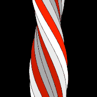

# Elastic Twister: A JS1k 2010 entry

An elastic twister effect created in 2010 for the [first JS1k](http://js1k.com/2010-first/) competition.

You can view and run the entry at http://js1k.com/2010-first/demo/213.

## Notes

Random notes based on fallible human memory follow:

 * The almost readable code in [twister.js](./twister.js) was originally minified using Google's [Closure Compiler Service](https://closure-compiler.appspot.com/). At the time Closure Compiler managed to compress the code down to [688 bytes](./twister.min.js). The compiler's current (2016-06-14) version seems to shave off further 99 bytes - impressive!

 * The effect is based on drawing horizontal lines. While the Canvas API *did* offer higher level tools for this, their performance was not up to snuff on some major browser of the day (Firefox 3.6?). Drawing the lines by manipulating an image data array directly and then calling [`putImageData`](https://developer.mozilla.org/en-US/docs/Web/API/CanvasRenderingContext2D/putImageData) solved that problem.
